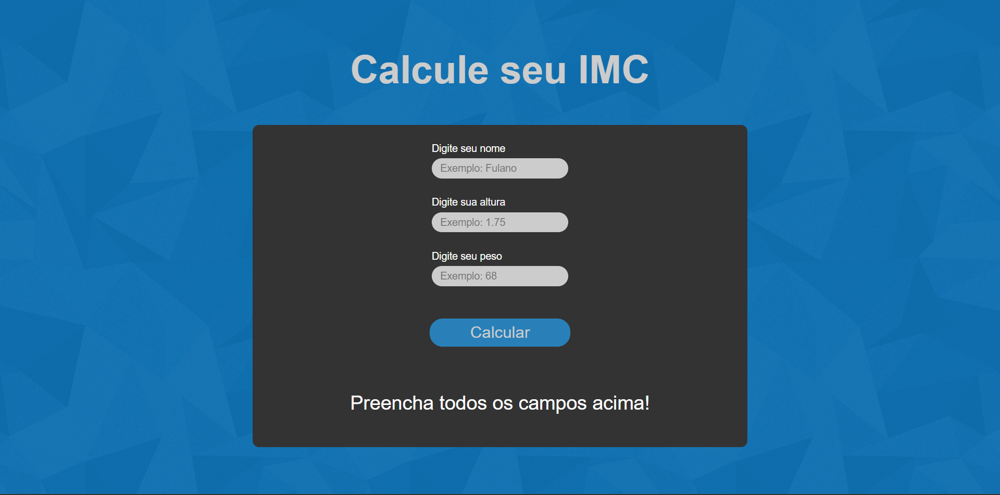

<h1 align="center"> Cálculo de IMC </h1>

Um site criado para calcular o IMC do usuário, usando tecnologias básicas de Front-End.

 

  

<h2>🖱️ Tecnologias</h2>

Este projeto foi feito com as tecnologias abaixo:

- HTML
- SCSS
- CSS
- JavaScript
- Biblioteca Live Server
- Git
- Github

 

## 🖥️ Deploy

Para checar o deploy, clique [neste link](https://calculo-do-imc.vercel.app).

 

## 📤 Instalação
 

> <h3>Primeiramente, você precisa <strong>clonar o projeto</strong> em sua máquina:</h3>
 

<code>git clone https://github.com/cristian-sbardelotto/calculo-do-imc</code>

 

> <h3>Depois disso, abra a pasta do projeto e <strong>instale as dependências:</strong></h3>
 

<code>npm i</code>

<code>yarn</code>

> <h3>Para <strong>rodar o projeto</strong> em seu Browser, use</h3>

<code>npm run dev</code>

<code>yarn dev</code>

 

---
 

<h2 align='center'>Aproveite o projeto!</h2>

Desenvolvido com  ❤️ por <strong>Cristian Sbardelotto</strong>

